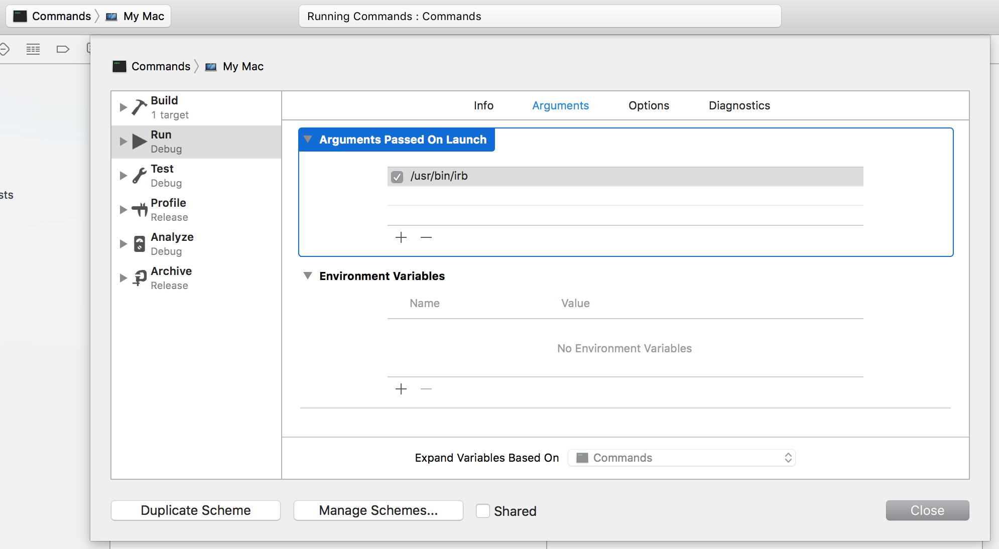
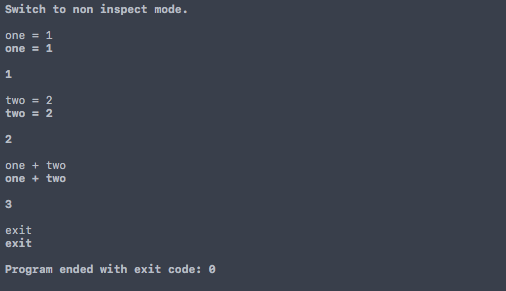

# Commands

**Commands** allows you to execute commands from within your application or via the command line tool **Commands** 

## Development

### Command line

**You can build and run an example from the command line:**

```bash
$ swift build
Compile Swift Module 'CommandsCore' (3 sources)
Compile Swift Module 'Commands' (1 sources)
Linking ./.build/x86_64-apple-macosx10.10/debug/Commands
$ ./.build/x86_64-apple-macosx10.10/debug/Commands '/usr/bin/irb'
Switch to inspect mode.

>> 
1+1
1+1

=> 2

>> 
exit
exit
```

### Xcode

**It's more funto do it within Xcode though:**

```bash
$ swift package generate-xcodeproj
generated: ./Commands.xcodeproj
```

Open the project add a launch argument to the **Commands** target's run phase.

```bash
$ open Commands.xcodeproj
```



The target is now configured to run an example with the Interactive Ruby Shell (IRB) to be launched. Select the _Commands_ scheme and _My Mac_ as target and hit the run button.



## Test

`swift test`

---

Have fun 🐼
